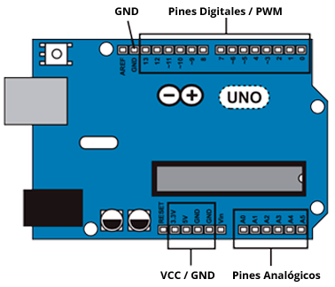
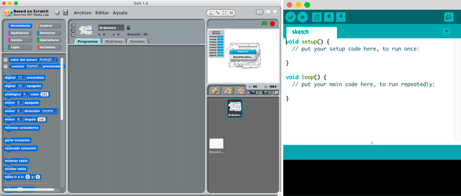

# Introducción a Arduino

<br>
*Fondo Europeo de Desarrollo Regional - Una manera de hacer Europa*


***


En este apartado verás una breve introducción al **hardware** y **software** de Arduino.

- [Qué es Arduino](#qué-es-arduino)
    - [Hardware](#hardware)
    - [Software](#software)
- [Instalación de la tarjeta de Arduino](#instalación-de-la-tarjeta-de-arduino)
    - [Posibles errores](#posibles-errores)  
- [mBlock Scratch y Arduino](#mblock-scratch-y-arduino)
    - [Instalar mBlock](#instalar-mblock) 
- [S4A Scratch y Arduino](#s4a-scratch-y-arduino)
    - [Instalar Scratch 4 Arduino](#instalar-scratch-4-arduino)
    - [Cargar el Firmware](#cargar-el-firmware)
- [Arduino IDE](#arduino-ide)
    - [Instalar Arduino IDE](#instalar-arduino-ide)
        - [Arduino IDE en Linux](#arduino-ide-en-linux)
        - [Arduino IDE en Windows](#arduino-ide-en-windows)
        - [Arduino IDE en Mac](#arduino-ide-en-mac)


***


## Qué es Arduino

**Arduino** es una plataforma para prototipado de electrónica basada en hardware y software libre y fácil de utilizar. Podemos construir circuitos electrónicos y programarlos para:
- iniciarnos en el mundo de la electrónica y robótica.
- construir componentes electrónicos a nuestro gusto.
- crear nuestro propio modelo de negocio.


<br />


Arduino se apoya en 2 pilares fundamentales; [Hardware](#hardware) (placa de Arduino) y [Software](#software) (entorno de programación).

### Hardware

Las principales características que podemos encontrar en nuestra placa de Arduino UNO Rev3, son las siguientes:
- El microcontrolador es un **circuito integrado programable** capaz de realizar operaciones matemáticas complejas a gran velocidad.
- Normalmente el modo de alimentación de una placa de Arduino es mediante el puerto USB mientras se está programando, pero hay ocasiones en la que necesitamos que el código de nuestra placa se siga ejecutándose sin estar conectado al equipo. Probablemente la forma más habitual de alimentar Arduino (sin utilizar tu equipo) es mediante una fuente de alimentación o pila de 9V. 
- Arduino dispone de un **regulador de voltaje interno** que actúa para que la tensión de alimentación no supere los 12V, ya que en caso contrario podemos dañar el regulador y con ello la placa de Arduino. Por otro lado, para tensiones inferiores a 7V en la alimentación, es probable que la placa no llegue a encenderse. La mayoría de los componentes electrónicos de Arduino utilizan una **tensión operativa de 5V** (ya regulada por el regulador de voltaje de la propia placa de Arduino).
- Tanto las **entradas** como las **salidas** dotan al sistema de información y realizan diferentes actuaciones.

| Características Arduino UNO Rev3           |           |
| ------------------------------------------ | --------- |
| Microcontrolador                           | ATmega328 |
| Tensión operativa                          | 5V        |
| Tensión de alimentación                    | 7-12V     |
| Máxima VC para entradas                    | 40mA      |
| Máxima VC para pines 3.3V                  | 50mA      |
| Entradas digitales                         | 14        |
| Salidas digitales                          | 14        |
| Entradas analógicas                        | 6         |
| Memoria flash                              | 32Kb      |
| SRAM                                       | 2Kb       |
| EEPROM                                     | 1Kb       |


<br />


Arduino contiene la siguiente distribución de pines:
- Disponemos de **14 pines digitales** que pueden ser configurados como entradas o salidas, de los cuales (serigrafiadas con el símbolo ~) pueden ser utilizados como señales digitales **PWM 6 pines**.
- Igualmente diponemos de **6 pines analógicos** serigrafiadas desde A0 hasta A5 para las entradas analógicas.
- También disponemos de **3 pines GND** para conectar a tierra nuestros circuitos.
- Y por último **2 pines de alimentación** de 5V y 3.3V respectivamente.



| Pines Arduino UNO Rev3  |           |
| ----------------------- | --------- |
| Entradas digitales      | 14        |
| Salidas digitales       | 14        |
| Salidas PWM       	  | 6         |
| Entradas analógicas     | 6         |
| GND (tierra)            | 3         |
| VCC 3.3V                | 1         |
| VCC 5V                  | 1         |


<br />


### Software

Para programar una tarjeta de Arduino, podemos utilizar diferentes lenguajes y entornos de programación. En este caso vamos a introducir la programación y electrónica con Arduino utilizando los lenguajes de programación por bloques y lenguajes de programación en modo texto.
- Lenguajes de programación por bloques:
    - [mBlock](#mBlock)
    - [Scratch 4 Arduino](#scratch-4-arduino)
- Lenguajes de programación en modo texto
    - [Arduino IDE](#arduino-ide)
    




***


## Instalación de la tarjeta de Arduino

Independientemente del sistema operativo que utilicemos, la primera vez que conectamos una tarjeta de Arduino a nuestro equipo, observaremos que será necesario **instalar los drivers** de la misma. Por ejemplo, en el caso de Windows observaremos que nos aparecerá un mensaje pidiendo permiso para instalar la nueva controladora detectada, en este caso, nuestra placa de Arduino.

Para comprobar su correcto funcionamiento conectamos la tarjeta al ordenador a través del cable USB y automáticamente el ordenador la reconocerá. Además, al instalar [Arduino IDE](#arduino-ide), los drivers de la tarjeta quedan instalados en el PC.


<br />


### Posibles errores

Es común encontrarse con pequeños errores que a continuación detallamos:
- En algunos equipos, los puertos USB delanteros no funcionan o no están conectados internamente.
- Al conectar la placa de Arduino por primera vez nos pedirá permiso para instalar los drivers. Para ello debemos tener permiso de administrador para instalarlo.
- En sistemas operativos como Windows XP, si no detecta la placa de Arduino debemos instalar los drivers desde `Panel de control > Agregar nuevo hardware`.


***


## mBlock Scratch y Arduino

**mBlock** es un entorno gráfico de programación basado en el editor Scratch 2.0 para introducir de forma sencilla la programación y robótica en el aula.

mBlock se compone de 5 partes principalmente:
- **Grupo de instrucciones** clasificadas por colores en las siguientes categorías:
    - *Movimiento*: Conjunto de instrucciones relacionadas con el control de los pines de la tarjeta de Arduino, así como el control del movimiento de cualquier personaje del escenario.
    - *Apariencia*: Instrucciones orientadas a modificar el aspecto de los personajes de nuestra aplicación. Para el caso de Arduino, es un conjunto de instrucciones que apenas se utiliza.
    - *Sonido*: Conjunto de instrucciones relacionadas con la elaboración de aplicaciones musicales, emitiendo sonidos y notas musicales.
    - *Lápiz*: Scratch nos ofrece la posibilidad de que los personajes dejen un rastro durante sus movimientos por el escenario como si arrastrase un lápiz durante su trayectoria.
    - *Control*: Las instrucciones incluídas en esta sección son impresindibles para crear la lógica de nuestros programas. Incluyen condicionales, bucles y llamadas de procedimientos.
    - *Sensores*: Instrucciones de iteración con el ratón, el teclado, sonidos y los personajes.
    - *Operadores*: operaciones matemáticas, lógicas y con cadenas de texto.
    - *Variables*: Instrucciones para el almacenamiento y gestión de datos.
- **Instrucciones** de programación: Las instrucciones de cada grupo corresponden a instrucciones de programación.
- **Editor**: Es la parte principal donde estructuramos y programamos nuestro programa.
    - *Programas*: Se compone de todas las instrucciones que hace funcionar el código que programemos.
    - *Disfraces*: Cada objeto puede tener diferentes apariencias o disfraces para utilizar a lo largo de nuestro programa.
    - *Sonido*: También es posible añadir o grabar sonidos y guardarlos para futuros usos.
- **Escenario** o ventana principal: Es el resultado de nuestro programa.
- **Objetos** y sprites: Distinguimos principalmente los objetos de tipo Arduino y Sprites.
    - Los *objetos* de tipo arduino son aquellos que interactuán con Arduino.
    - Los *sprites* son similares al entorno de scratch y no interactúan con Arduino.
    


<br />


### Instalar mBlock

Independientemente del sistema operativo que utilicemos, desde la [web del proyecto](https://www.makeblock.es/soporte/mblock/) está disponible para Windows y Mac, siendo la instalación similar.


***


## Scratch 4 Arduino

Scratch 4 Arduino **(S4A)** es una modificación del software libre de Scratch que nos permite crear programas para Arduino, pero tenemos que tener en cuenta que los proyectos siempre serán dependientes de la conexión con S4A, es decir, debemos tener S4A ejecutándose en nuestro equipo al mismo tiempo.

Está basado en el lenguaje de programación por bloques y sus instrucciones han sido diseñadas con un lenguaje natural, eliminando términos técnicos y empleando una terminología más natural. Así se facilita el acceso a la programación en niveles educativos básicos.

S4A se compone de 5 partes principalmente:
- **Grupo de instrucciones** clasificadas por colores en las siguientes categorías:
    - *Movimiento*: Conjunto de instrucciones relacionadas con el control de los pines de la tarjeta de Arduino, así como el control del movimiento de cualquier personaje del escenario.
    - *Apariencia*: Instrucciones orientadas a modificar el aspecto de los personajes de nuestra aplicación. Para el caso de Arduino, es un conjunto de instrucciones que apenas se utiliza.
    - *Sonido*: Conjunto de instrucciones relacionadas con la elaboración de aplicaciones musicales, emitiendo sonidos y notas musicales.
    - *Lápiz*: Scratch nos ofrece la posibilidad de que los personajes dejen un rastro durante sus movimientos por el escenario como si arrastrase un lápiz durante su trayectoria.
    - *Control*: Las instrucciones incluídas en esta sección son impresindibles para crear la lógica de nuestros programas. Incluyen condicionales, bucles y llamadas de procedimientos.
    - *Sensores*: Instrucciones de iteración con el ratón, el teclado, sonidos y los personajes.
    - *Operadores*: operaciones matemáticas, lógicas y con cadenas de texto.
    - *Variables*: Instrucciones para el almacenamiento y gestión de datos.
- **Instrucciones** de programación: Las instrucciones de cada grupo corresponden a instrucciones de programación.
- **Editor**: Es la parte principal donde estructuramos y programamos nuestro programa.
    - *Programas*: Se compone de todas las instrucciones que hace funcionar el código que programemos.
    - *Disfraces*: Cada objeto puede tener diferentes apariencias o disfraces para utilizar a lo largo de nuestro programa.
    - *Sonido*: También es posible añadir o grabar sonidos y guardarlos para futuros usos.
- **Escenario** o ventana principal: Es el resultado de nuestro programa.
- **Objetos** y sprites: Distinguimos principalmente los objetos de tipo Arduino y Sprites.
    - Los *objetos* de tipo arduino son aquellos que interactuán con Arduino.
    - Los *sprites* son similares al entorno de scratch y no interactúan con Arduino.


<br />


### Instalar Scratch 4 Arduino
 
Independientemente del sistema operativo que utilicemos, desde la [web del proyecto](http://s4a.cat) está disponible para Windows, Linux y Mac, siendo la instalación similar.

Para instalar S4A en nuestro equipo debemos seguir los siguientes pasos:

1. Tener instalado [Arduino IDE](#arduino-ide) en primer lugar (véase sección).
2. Cargar un pequeño programa o [firmware](#cargar-el-firmware) en la placa de Arduino.
3. Instalar S4A desde la web [s4a.cat](http://s4a.cat) siguiendo los pasos de instalación. 


<br />


### Cargar el Firmware

Para que S4A reconozca y se comunique con la tarjeta de Arduino, debemos cargar un firmware o controlador en la misma. Para ello debemos seguir los siguientes pasos:

1. Abrir el archivo [S4AFirmware16.ino](http://vps34736.ovh.net/S4A/S4AFirmware16.ino) con Arduino IDE.
2. Cargar el firmware en la placa de Arduino habiendo comprobado previamente que la placa de Arduino ha sido detectada por nuestro equipo y funciona correctamente.
3. Probar que detecta correctamente nuestra placa en S4A.


<br />


#### Posibles errores

Durante las prácticas en las sesiones presenciales hemos detectado los siguientes errores:

- En algunos equipos, los puertos USB delanteros no funcionan.
- En sistemas operativos Windows XP:
    - Al conectar la placa de Arduino por primera vez nos pedirá permiso para instalar los drivers. Para ello debemos tener permiso de administrador para instalarlo.
    - Si no detecta la placa de Arduino debemos instalar los drivers desde `Panel de control > Agregar nuevo hardware`.
- Al cargar el firmware de S4A en nuestra placa de Arduino, debemos seleccionar la placa y el puerto correcto desde el software de Arduino IDE. 


***


## Arduino IDE

Arduino IDE es un editor de texto y compilador para programar y transferir el contenido de las instrucciones a la placa de Arduino en su lenguaje máquina. El lenguaje de programación utilizado es [Processing](https://processing.org/).

El Software Arduino IDE se compone de 3 partes principalmente:
- **Botonera** o barra de navegación:
    - *Verificar*: Se encarga de verificar la sintaxis de nuestro programa.
    - *Cargar*: Si la verificación ha sido correcta, podemos cargar el código en nuestra placa de Arduino.
    - *Nuevo*: Simplemente abrimos un documento vacio (salvo funciones principales) para comenzar un nuevo programa.
    - *Abrir*: Para abrir proyectos en otros directorios o rutas.
    - *Guardar*: Simplemente guarda el programa en el directorio que especifiquemos (si es la primera vez que lo guardamos).
    - *Monitor serial*: Supongamos que necesitamos saber en algún momento qué ocurre dentro de nuestra placa de Arduino, pues bien, mediante el monitor serial podemos enviar datos que se mostrarán en nuestro monitor.
- **Editor** de programación: Es la parte principal de Arduino IDE, básicamente donde se programan las líneas y líneas de código en lenguaje processing.
- **Notificaciones**: Conocido normalmente por consola, es la parte de depuración donde notifica al programador sobre errores de sintaxis, comunicación, etc.


<br />


### Instalar Arduino IDE

En primer lugar debemos acceder y descargar el software desde la página web [Arduino.org](http://www.arduino.org). Dependiendo del sistema operativo que utilicemos procederemos a una de las siguientes instalaciones.

- [Arduino IDE en Linux](#arduino-ide-en-linux)
- [Arduino IDE en Windows](#arduino-ide-en-windows)
- [Arduino IDE en Mac](#arduino-ide-en-mac)


<br />


#### Arduino IDE en Linux

Nos hemos basado en la distribución **Ubuntu** para realizar esta guía de instalación puesto que la mayoría de las distribuciones de Linux a nivel educativo se basan en ella.

Para trabajar con Arduino es preciso que nuestra distribución tenga instalados los siguientes paquetes además de Arduino IDE.

```
- sun's java runtime (jre)
- gcc-avr
- avr-libc
- binutils-avr
```

Para instalar dichos paquetes vamos a necesitar la clave de administrador. A continuación abrimos un nuevo terminal o consola y ejecutamos las siguientes instrucciones:

```
$ sudo add-apt-repository ppa:arduino-ubuntu-team
$ sudo apt-get update
$ sudo apt-get install arduino
```

Para ejecutar la aplicación de Arduino IDE, basta con acceder al menú *Aplicaciones > Programación > Arduino*.


<br />


#### Arduino IDE en Windows

Descargamos el software de Arduino desde la sección de descargas de la página web [Arduino.org](http://www.arduino.org/downloads) y procedemos a ejecutar el programa descargado aceptando la licencia de uso y siguiendo los pasos que aparecen en el instalador.


<br />


#### Arduino IDE en Mac

De igual manera que en el caso de instalación en Windows, en primer lugar descargamos el software de Arduino desde la sección de descargas de la página web [Arduino.org](http://www.arduino.org/downloads) y procedemos a ejecutar el programa descargado aceptando la licencia de uso y siguiendo los pasos que aparecen en el instalador.


***


#### Licencia

 Esta obra se distribuye bajo licencia [Reconocimiento-CompartirIgual 4.0 Internacional (CC BY-SA 4.0)](https://creativecommons.org/licenses/by-sa/4.0/deed.es_ES).
